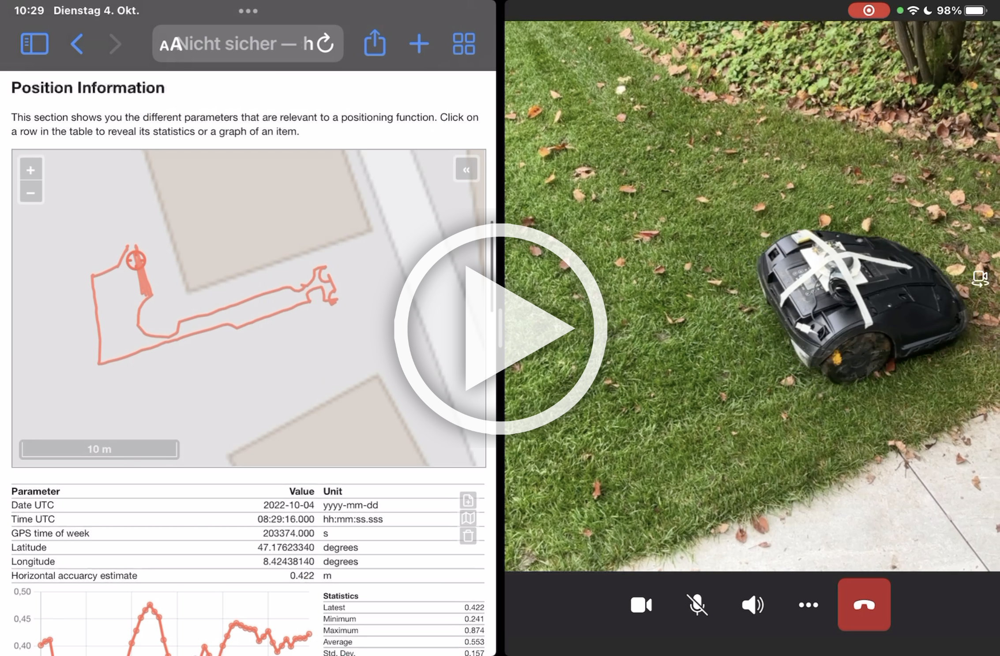
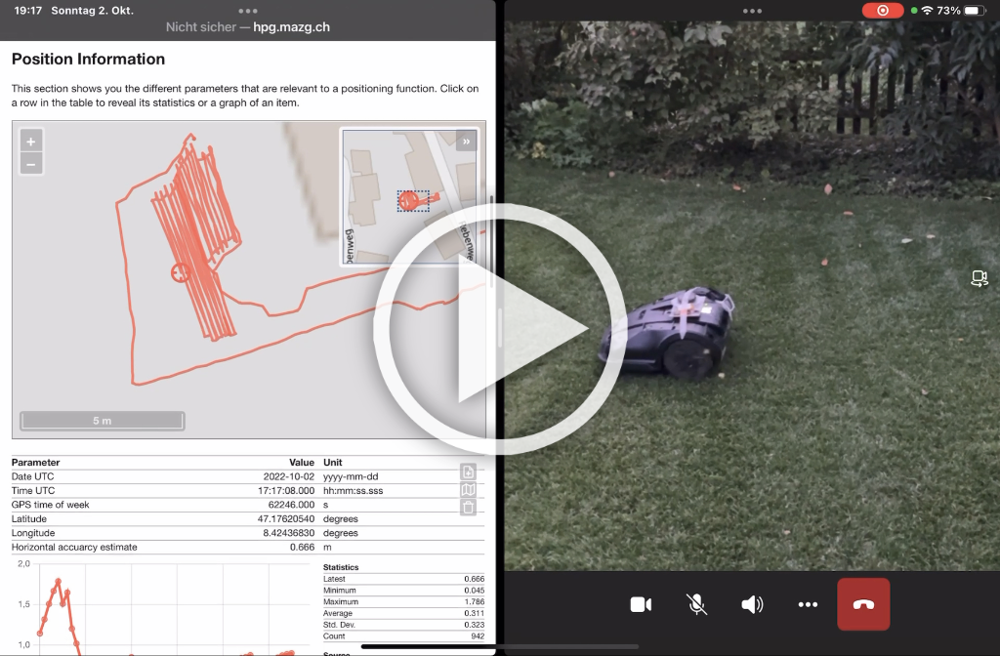

# Lawn Mower & Slow Moving Robots

The HPG solution can be easily fitted to a lawn mower or slow moving robot to test the performance. 

The scooters from BOSCH can be easily modified to extract the Hall sensor signals that are used as a distance sensor by the ZED-F9R WT input. First you need to open the mower. Remove the green and black cover by releasing the 6 plastic latches from the bottom side. Release the 8 screws, 6 are easily accessible and two are hidden under the black button with an arrow on it, just next to the red stop botton. Now the black cover can be removed. The Hall sensors signals can be tapped in on the Green, Purple and Gray wires on the two motor connectors. In addition Red is 5V and may be Black is GND and5 volts. The signal from the ahll sensor is 3.3Vand can directly be used. The three thicker wires are to drive the motor. 

To convert the Hall sensors signals to a ``UBX-ESF-MEAS`` a small Arduino MCU with at least 7 GPIOs is used. This code could be integrated with the main project but we don't have enough spare GPIOs on the hpg board and maybe it also better to avoid large delays in processing and sampling the Hall signals. For details about standalone software project go to [wtBox](../software/wtBox/). I used 1kOhm resistors to connect the wtBox to the Hall sensor wires of the mower, and also for the connection to the HPG board ``ZED RXI`` pin and ``GND`` pins. This reduces the risk for accidential issues in case one of the boards is msibehaving or off. The following picture shows how the board is connected to the wires, at the time of this photo the non defualt ``D8`` was used for ``D4 TX1 -> ESF-MEAS -> ZED RXI``, this was later changed to the default ``D4 TX1`` location that is also connected to the LED on the board. In [``GNSS.h``](../software/GNSS.h) you need to set the ``dynModel = DYN_MODEL_MOWER`` that applies certain configurations required to ZED, you may also need to change the ``odoFactor`` for the wheel circumference as well as the ticks per revolution. 

Here is the HPG board and antenna mounted to the mower. The GNSS antenna and the IMU sensor are positioned centered above the rear axle, with X axis pointing accurately towards the front. This will ensure best performance and only minimal configuration for sensor fusion is needed.  

  

Below a short video of the mower and the monitor website in action. The first 10 minutes shows the calibration of the sensors and the wheel ticks, during this time, sensor fusion is initializing and calibrating. At position [9:50](https://youtu.be/d0S1z9fmatQ?t=590) the sensor fusion swiches into fusion mode and is now able to naviagte more reliably using the sensors and determine the heading or course over ground even while rotateing at its location. 

